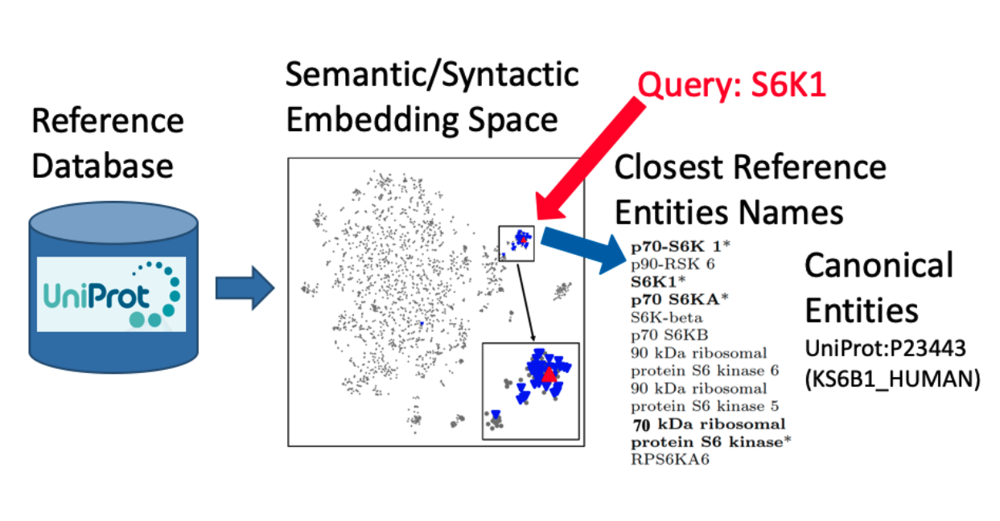

# Neural-Indexing-EntityNormalization

This repository is an example work of how can we do Entity Normalization with Semantic Embedding using Siamese-BERT model. The original motivation is to map entity mentions to a well-known entites in reference dataset. However, the scope of this works only consider how to normalize a given text/query to the reference entity as shown below.



### Acknowledgement
This repository is built on top of the following amazing works:
- NSEEN [Link](https://arxiv.org/abs/1811.07514): 
  This paper describes the core approach for using neural similarity for entity normalization: 
  Shobeir Fakhraei, Joel Mathew, and Jose Luis Ambite. NSEEN: Neural Semantic Embedding for Entity Normalization. European Conference on Machine Learning and Principles and Practice of Knowledge Discovery in Databases (ECML-PKDD-2019),Würzburg, Germany. 
  In this repository, we replaced the original BiLSTM with Transformer-based language models.  
- Sentence Transformer [Link](https://github.com/UKPLab/sentence-transformers)
- Sentence-BERT: Sentence Embeddings using Siamese BERT-Networks ([EMNLP 2019](https://arxiv.org/abs/1908.10084))
- ElasticSearch [Link](https://www.elastic.co/guide/en/elasticsearch/reference/current/install-elasticsearch.html)
- Annoy [Link](https://github.com/spotify/annoy)
- Hugging Transformer [Link](https://github.com/huggingface/transformers)
- dmis-lab/biobert [Link](https://github.com/dmis-lab/biobert)

### How to run the script
Once cloned, please do the following steps:
```
cd repor-dir
./create_folders.sh
pip install -r requirements.txt
```

To install Elasticsearch locally, please take a look at this [Link](https://www.elastic.co/guide/en/elasticsearch/reference/current/install-elasticsearch.html)

### License
TBD
